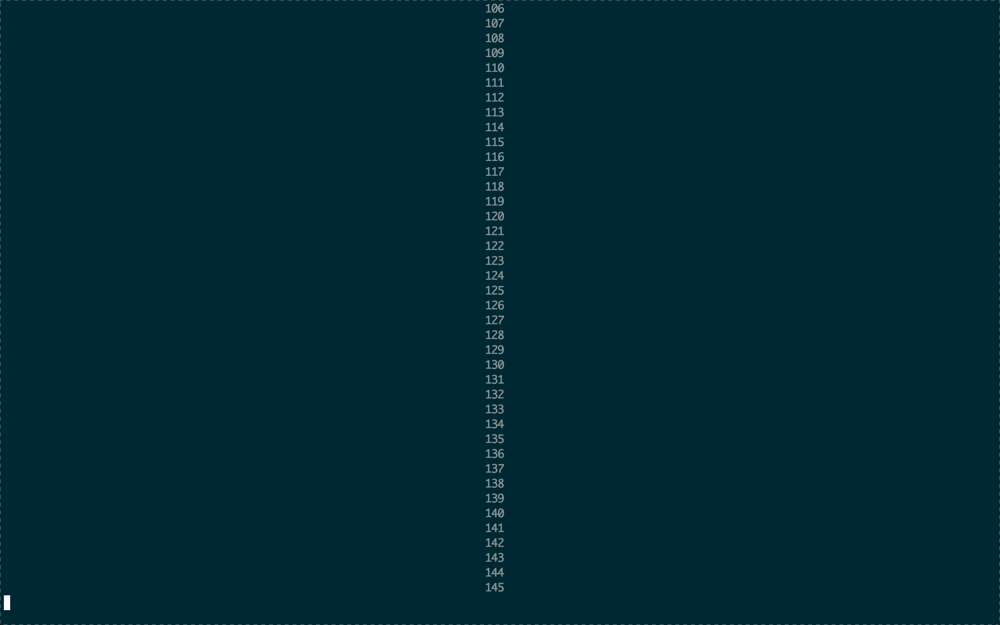

MeditationTimer
===============

Very simple meditation timer for the terminal. I figured I'd throw it up here for anyone who wanted it. Feel free to use it for anything you wish. Best used full screen:

Usage
=====

    python MeditationTimer # For 10 minutes
    python MeditationTimer -t 15 # For 15 minutes
    python MeditationTimer --circuitTraining # For Circuit Training
    python MeditationTimer --bodyScan # For Body Scanning

Both circuit training and body scanning are practices found in Chade-Meng Tan's book, [Search Inside Yourself](http://www.amazon.com/Search-Inside-Yourself-Unexpected-Achieving/dp/0062116924). This book acts as a beginner to intermediate introduction to meditation, mindfulness and emotional intelligence.
   
I'd suggest adding an alias in your bashrc for `python /--path-to-repo--/MeditationTimer.py` to something like `med`, or adding it to your path. This way, you can just type `med -t 5` when you need to quickly meditate for 5 minutes.
